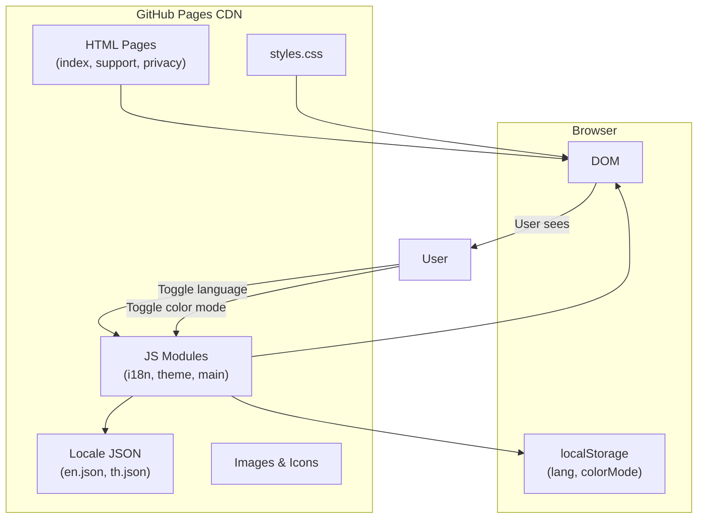
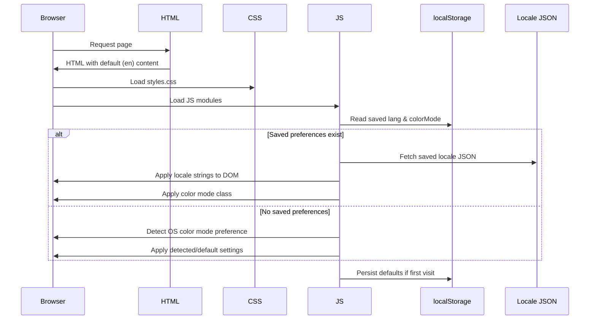

# Design Document: Routina Landing Page

## Overview

This design describes a static marketing website for the Routina iOS app, hosted on GitHub Pages. The site consists of three pages — a landing page, a support page, and a privacy page — built with plain HTML, CSS, and JavaScript (no build step, no frameworks). It supports English/Thai localization, light/dark color modes, responsive layouts from 320px to 2560px, and meets performance, accessibility, and SEO requirements.

The architecture follows a "vanilla web" approach: each page is a standalone HTML file that shares a common CSS stylesheet and a small JavaScript module for localization, color mode toggling, and navigation behavior. Translation strings live in JSON files loaded at runtime, enabling language switching without page reloads.

### Key Design Decisions

| Decision | Rationale |
|----------|-----------|
| No build step or framework | Requirement 1 mandates pure static files deployable to GitHub Pages by pushing to a branch. Vanilla HTML/CSS/JS is the simplest path. |
| Runtime i18n via JSON + `data-i18n` attributes | Enables language switching without page reload (Req 10.3) while keeping translations separate from markup for maintainability. |
| CSS custom properties for theming | Allows instant color mode switching (Req 11.3) by toggling a class on `<html>`, with no page reload. |
| Single shared CSS file | Three pages share the same design system. One file reduces HTTP requests and keeps styles consistent. |
| `localStorage` for preferences | Persists language and color mode choices across visits (Req 10.5, 11.5) without any server-side state. |

## Architecture

### Site Structure

```
/
├── index.html                  # Landing page
├── docs/
│   ├── support.html            # Support page (/docs/support)
│   └── privacy.html            # Privacy page (/docs/privacy)
├── css/
│   └── styles.css              # Shared stylesheet
├── js/
│   ├── i18n.js                 # Localization engine
│   ├── theme.js                # Color mode toggle logic
│   └── main.js                 # Navigation, scroll, shared behavior
├── locales/
│   ├── en.json                 # English translations
│   └── th.json                 # Thai translations
├── images/
│   ├── app-icon.png            # Routina app icon
│   ├── mockup.png              # Device mockup image
│   └── og-image.png            # Open Graph social sharing image
└── CNAME                       # Optional custom domain config
```

GitHub Pages serves `index.html` at the root. The `/docs/support` and `/docs/privacy` paths resolve to `docs/support.html` and `docs/privacy.html` respectively (GitHub Pages serves `.html` files at their extensionless path by default).

### High-Level Architecture Diagram



### Page Load Sequence



## Components and Interfaces

### 1. HTML Pages

Each page follows a shared structure:

```html
<!DOCTYPE html>
<html lang="en">
<head>
    <meta charset="UTF-8">
    <meta name="viewport" content="width=device-width, initial-scale=1.0">
    <!-- SEO meta tags, Open Graph, canonical URL -->
    <link rel="stylesheet" href="/css/styles.css">
</head>
<body>
    <header class="site-header">
        <nav><!-- Logo, nav links, Language_Switcher, Color_Mode_Toggle --></nav>
    </header>
    <main>
        <!-- Page-specific content with data-i18n attributes -->
    </main>
    <footer class="site-footer">
        <!-- Medical disclaimer, nav links, copyright -->
    </footer>
    <script type="module" src="/js/main.js"></script>
</body>
</html>
```

All text elements that need translation carry a `data-i18n="key"` attribute. The HTML ships with English text as the default content (visible before JS loads), ensuring the page is usable even if JavaScript fails.

### 2. Localization Engine (`i18n.js`)

**Interface:**

```javascript
// i18n.js - Localization module
const I18N_STORAGE_KEY = 'routina-lang';
const DEFAULT_LANG = 'en';
const SUPPORTED_LANGS = ['en', 'th'];

/**
 * Initialize i18n: read saved preference or default, load locale, apply.
 * @returns {Promise<void>}
 */
export async function initI18n() { }

/**
 * Switch to a new language, update DOM, persist choice.
 * @param {string} lang - 'en' or 'th'
 * @returns {Promise<void>}
 */
export async function setLanguage(lang) { }

/**
 * Get the currently active language code.
 * @returns {string}
 */
export function getCurrentLanguage() { }
```

**Behavior:**
- On init, reads `localStorage` for saved language. Falls back to `'en'`.
- Fetches the corresponding `/locales/{lang}.json` file.
- Iterates all elements with `data-i18n` attribute and sets their `textContent` to the matching translation value.
- For elements needing HTML content (e.g., links within text), uses `data-i18n-html` attribute and sets `innerHTML`.
- Updates `<html lang="...">` attribute to match selected language (Req 14.5).
- Caches loaded locale data in memory to avoid re-fetching on toggle.

### 3. Theme Manager (`theme.js`)

**Interface:**

```javascript
// theme.js - Color mode management
const THEME_STORAGE_KEY = 'routina-color-mode';

/**
 * Initialize theme: read saved preference or detect OS preference, apply.
 */
export function initTheme() { }

/**
 * Toggle between light and dark mode, update DOM, persist choice.
 */
export function toggleTheme() { }

/**
 * Get the currently active color mode.
 * @returns {'light' | 'dark'}
 */
export function getCurrentTheme() { }
```

**Behavior:**
- On init, reads `localStorage` for saved mode. If none, uses `window.matchMedia('(prefers-color-scheme: dark)')` to detect OS preference (Req 11.4).
- Applies mode by setting `data-theme="light"` or `data-theme="dark"` on `<html>`.
- CSS custom properties switch values based on `[data-theme]` selector.
- Persists choice to `localStorage`.

### 4. Main Controller (`main.js`)

**Interface:**

```javascript
// main.js - App initialization and shared behavior
import { initI18n, setLanguage } from './i18n.js';
import { initTheme, toggleTheme } from './theme.js';

/**
 * Initialize all site functionality on DOMContentLoaded.
 */
function init() { }
```

**Responsibilities:**
- Calls `initI18n()` and `initTheme()` on `DOMContentLoaded`.
- Binds click handler on Language_Switcher to call `setLanguage()`.
- Binds click handler on Color_Mode_Toggle to call `toggleTheme()`.
- Handles smooth scroll for anchor links on the landing page.
- Sets up any interactive elements (e.g., FAQ accordion on support page).

### 5. CSS Design System (`styles.css`)

**Color Tokens (CSS Custom Properties):**

```css
:root,
[data-theme="light"] {
    --color-primary: #6366F1;
    --color-secondary: #34D399;
    --color-accent: #F59E0B;
    --color-success: #22C55E;
    --color-error: #EF4444;
    --color-bg: #F9FAFB;
    --color-text: #1F2937;
    --color-text-secondary: #6B7280;
    --color-surface: #FFFFFF;
    --color-border: #E5E7EB;
}

[data-theme="dark"] {
    --color-primary: #818CF8;
    --color-secondary: #6EE7B7;
    --color-accent: #FCD34D;
    --color-success: #4ADE80;
    --color-error: #F87171;
    --color-bg: #0F172A;
    --color-text: #F1F5F9;
    --color-text-secondary: #94A3B8;
    --color-surface: #1E293B;
    --color-border: #334155;
}
```

**Responsive Breakpoints:**

| Breakpoint | Range | Layout |
|-----------|-------|--------|
| Mobile | 320px – 767px | Single column, stacked sections, hamburger nav |
| Tablet | 768px – 1023px | Two-column grids for features, side-by-side layout |
| Desktop | 1024px – 2560px | Multi-column grids, max-width container (1200px), centered |

**Key CSS Patterns:**
- `min-height: 44px; min-width: 44px;` on all interactive elements for touch targets (Req 12.3).
- Semantic HTML elements (`<header>`, `<nav>`, `<main>`, `<section>`, `<footer>`) for structure (Req 14.2).
- `max-width: 1200px; margin: 0 auto;` container for readable line lengths on wide screens.
- CSS Grid for feature cards, Flexbox for header/footer layout.

### 6. Landing Page Sections

| Section | Content | Key Elements |
|---------|---------|-------------|
| Hero | App name, tagline, App Store CTA, device mockup | `<section id="hero">` with app icon/mockup image, h1, tagline paragraph, App Store badge link (`target="_blank" rel="noopener"`) |
| Features | 6+ feature cards with icons and descriptions | `<section id="features">` with CSS Grid of cards. Features: flexible scheduling, one-tap completion, streak tracking, CloudKit sync, Apple Watch, widgets. Additional mention of voice search and quick add. |
| Pricing | $3.99 one-time, no ads/subs/IAP, App Store CTA | `<section id="pricing">` with price display, value propositions, App Store link |
| Platform | iPhone, iPad, Apple Watch, iOS 26.0+ | `<section id="platform">` with device icons and compatibility info |
| Privacy Summary | No analytics, no ads, no crash SDKs, link to full policy | `<section id="privacy-summary">` with privacy highlights and link to `/docs/privacy` |

### 7. Navigation Header

```html
<header class="site-header" role="banner">
    <nav aria-label="Main navigation">
        <a href="/" class="logo" data-i18n="nav.home">Routina</a>
        <ul class="nav-links">
            <li><a href="/" data-i18n="nav.home">Home</a></li>
            <li><a href="/docs/support" data-i18n="nav.support">Support</a></li>
            <li><a href="/docs/privacy" data-i18n="nav.privacy">Privacy</a></li>
        </ul>
        <div class="nav-controls">
            <button class="lang-switcher" aria-label="Switch language">EN/TH</button>
            <button class="theme-toggle" aria-label="Toggle color mode">🌙/☀️</button>
        </div>
        <button class="mobile-menu-toggle" aria-label="Toggle menu" aria-expanded="false">☰</button>
    </nav>
</header>
```

### 8. Footer

```html
<footer class="site-footer" role="contentinfo">
    <p class="disclaimer" data-i18n="footer.disclaimer">
        Routina is not a medical app and provides reminders only.
    </p>
    <nav aria-label="Footer navigation">
        <a href="/docs/support" data-i18n="nav.support">Support</a>
        <a href="/docs/privacy" data-i18n="nav.privacy">Privacy</a>
    </nav>
    <p class="copyright" data-i18n="footer.copyright">© 2025 Routina. All rights reserved.</p>
</footer>
```

## Data Models

### Locale JSON Structure

Each locale file (`en.json`, `th.json`) follows a flat-nested key structure:

```json
{
    "nav": {
        "home": "Home",
        "support": "Support",
        "privacy": "Privacy"
    },
    "hero": {
        "title": "Routina",
        "tagline": "Smart routine management for iOS",
        "cta": "Download on the App Store"
    },
    "features": {
        "title": "Features",
        "scheduling": {
            "title": "Flexible Scheduling",
            "description": "Fixed times, intervals, or contextual triggers — schedule routines your way."
        },
        "completion": {
            "title": "One-Tap Completion",
            "description": "Log your routines with a single tap. Fast and frictionless."
        },
        "streaks": {
            "title": "Streak Tracking",
            "description": "Build consistency with daily streaks and completion stats."
        },
        "sync": {
            "title": "CloudKit Sync",
            "description": "Your data syncs across iPhone, iPad, and Apple Watch via iCloud."
        },
        "watch": {
            "title": "Apple Watch",
            "description": "Check and complete routines right from your wrist."
        },
        "widgets": {
            "title": "Widgets",
            "description": "See what's due at a glance from your Home Screen or Lock Screen."
        },
        "voice": {
            "title": "Voice Search & Quick Add",
            "description": "Find or add routines using your voice."
        }
    },
    "pricing": {
        "title": "Simple Pricing",
        "price": "$3.99",
        "subtitle": "One-time purchase",
        "noAds": "No ads",
        "noSubscriptions": "No subscriptions",
        "noIAP": "No in-app purchases",
        "cta": "Get Routina"
    },
    "platform": {
        "title": "Works Across Your Devices",
        "devices": "iPhone · iPad · Apple Watch",
        "requirement": "Requires iOS 26.0 or later"
    },
    "privacySummary": {
        "title": "Your Privacy Matters",
        "description": "No third-party analytics. No ads. No crash reporting SDKs. Your data stays yours.",
        "link": "Read our full Privacy Policy"
    },
    "footer": {
        "disclaimer": "Routina is not a medical app and provides reminders only.",
        "copyright": "© 2025 Routina. All rights reserved."
    },
    "support": {
        "title": "Support",
        "contact": "Contact us",
        "email": "support@routina.app",
        "faqTitle": "Frequently Asked Questions",
        "faq": [
            {
                "q": "How do I create a new routine?",
                "a": "Tap the + button on the Today tab, enter a name, choose a schedule type, and save."
            }
        ]
    },
    "privacy": {
        "title": "Privacy Policy",
        "intro": "Your privacy is important to us..."
    }
}
```

### SEO Structured Data (JSON-LD)

The landing page includes a `SoftwareApplication` schema in a `<script type="application/ld+json">` block:

```json
{
    "@context": "https://schema.org",
    "@type": "SoftwareApplication",
    "name": "Routina",
    "operatingSystem": "iOS 26.0+",
    "applicationCategory": "HealthApplication",
    "offers": {
        "@type": "Offer",
        "price": "3.99",
        "priceCurrency": "USD"
    },
    "description": "Smart routine management for iOS. Track supplements, habits, and daily routines with flexible scheduling and intelligent reminders.",
    "screenshot": "https://routina.app/images/mockup.png",
    "softwareVersion": "1.0",
    "author": {
        "@type": "Organization",
        "name": "Routina"
    }
}
```

### localStorage Keys

| Key | Type | Values | Default |
|-----|------|--------|---------|
| `routina-lang` | string | `'en'` \| `'th'` | `'en'` |
| `routina-color-mode` | string | `'light'` \| `'dark'` | OS preference |


## Correctness Properties

*A property is a characteristic or behavior that should hold true across all valid executions of a system — essentially, a formal statement about what the system should do. Properties serve as the bridge between human-readable specifications and machine-verifiable correctness guarantees.*

### Property 1: Locale key parity

*For any* translation key present in one locale file (en.json or th.json), that key must also exist in the other locale file with a non-empty string value. Both locale files must have identical key structures.

**Validates: Requirements 10.1**

### Property 2: i18n application completeness

*For any* DOM element with a `data-i18n` attribute and *for any* supported language, after calling `setLanguage(lang)`, the element's text content should equal the value at that key path in the loaded locale JSON, and `document.documentElement.lang` should equal the selected language code.

**Validates: Requirements 10.3, 14.5**

### Property 3: Language preference persistence round-trip

*For any* supported language code, after calling `setLanguage(lang)`, reading `localStorage.getItem('routina-lang')` should return that language code, and re-initializing the i18n module should activate the same language.

**Validates: Requirements 10.5**

### Property 4: Theme toggle round-trip and persistence

*For any* initial color mode (light or dark), calling `toggleTheme()` should switch to the opposite mode and persist it to `localStorage`, and calling `toggleTheme()` again should restore the original mode. That is, `toggleTheme(toggleTheme(mode)) === mode`.

**Validates: Requirements 11.3, 11.5**

### Property 5: Interactive element touch target size

*For any* interactive element (`<button>`, `<a>`, `<input>`) on any page rendered at a mobile viewport width (≤ 767px), the element's computed width and height should each be at least 44 CSS pixels.

**Validates: Requirements 12.3**

### Property 6: Image accessibility

*For any* `` element on any page of the site, the element must have a non-empty `alt` attribute.

**Validates: Requirements 14.3**

## Error Handling

### JavaScript Failures

| Scenario | Handling |
|----------|----------|
| JS fails to load or execute | HTML ships with English text as default content. The page is fully readable without JS — only language switching and theme toggling are unavailable. |
| Locale JSON fetch fails | Catch the fetch error, log to console, keep current language. Display a subtle inline message if the user triggered the switch. |
| Invalid localStorage data | Validate stored values against known options (`SUPPORTED_LANGS`, `['light', 'dark']`). Fall back to defaults if invalid. |
| Missing translation key | If a `data-i18n` key has no match in the locale JSON, leave the element's existing text content unchanged (English fallback). Log a warning to console. |

### Asset Loading

| Scenario | Handling |
|----------|----------|
| Image fails to load | Use meaningful `alt` text so content is still conveyed. Consider CSS fallback backgrounds for decorative images. |
| CSS fails to load | HTML semantic structure remains navigable. Content is accessible even without styling. |
| CDN font fails | Use `font-display: swap` and a system font stack fallback (`-apple-system, BlinkMacSystemFont, 'Segoe UI', sans-serif`). |

### Navigation

| Scenario | Handling |
|----------|----------|
| 404 on subpages | GitHub Pages shows its default 404 page. Optionally add a custom `404.html` with navigation back to the landing page. |
| JavaScript-disabled browser | All navigation links are standard `<a>` tags — they work without JS. Only language/theme toggles require JS. |

## Testing Strategy

### Unit Tests (Example-Based)

Unit tests verify specific, concrete behaviors using a DOM testing library (e.g., jsdom with a lightweight test runner like Vitest).

| Test Area | What to Verify |
|-----------|---------------|
| Page content | Hero section contains app name, tagline, CTA; Feature section has 6+ features; Pricing shows $3.99; etc. |
| Navigation | Header and footer present on all pages with correct links |
| SEO | Meta tags, canonical URLs, JSON-LD structured data present |
| Semantic HTML | Pages use header, nav, main, section, footer elements |
| Accessibility | ARIA labels on interactive controls, alt text on images |
| Default behavior | Default language is English, default theme follows OS preference |
| FAQ content | Support page has ≥ 5 FAQ items |

### Property-Based Tests

Property-based tests verify universal properties across generated inputs using [fast-check](https://github.com/dubzzz/fast-check) with Vitest.

Each property test runs a minimum of 100 iterations and is tagged with its design document property reference.

| Property | Test Approach |
|----------|--------------|
| Property 1: Locale key parity | Generate/enumerate all keys from both locale JSON files. For each key, assert it exists in both files with a non-empty value. |
| Property 2: i18n application completeness | For randomly selected data-i18n elements and randomly selected languages, call setLanguage and verify textContent matches the locale value and html lang is updated. |
| Property 3: Language persistence round-trip | For any language from the supported set, call setLanguage, then verify localStorage contains it, then re-init and verify the same language is active. |
| Property 4: Theme toggle round-trip | For any starting theme, toggle once (verify opposite + persisted), toggle again (verify original restored). |
| Property 5: Touch target size | For all interactive elements at mobile viewport, verify computed dimensions ≥ 44px. |
| Property 6: Image alt text | For all img elements across all pages, verify non-empty alt attribute. |

**Test Configuration:**
- Test runner: Vitest (no build step needed for tests — runs with Node)
- PBT library: fast-check
- DOM environment: jsdom (via Vitest config)
- Minimum iterations: 100 per property test
- Tag format: `Feature: routina-landing-page, Property {N}: {title}`

### Integration Tests

| Test | Approach |
|------|----------|
| Lighthouse performance | Run Lighthouse CI against deployed site, assert score ≥ 90 |
| Color contrast | Run axe-core against each page in both color modes, assert no contrast violations |
| Cross-browser rendering | Manual verification on Chrome, Safari, Firefox at key breakpoints |
| GitHub Pages deployment | Push to branch, verify site loads at expected URL |

### Test File Structure

```
tests/
├── unit/
│   ├── landing-page.test.js
│   ├── support-page.test.js
│   ├── privacy-page.test.js
│   └── navigation.test.js
├── property/
│   ├── i18n.property.test.js
│   ├── theme.property.test.js
│   ├── accessibility.property.test.js
│   └── locale-parity.property.test.js
└── vitest.config.js
```
